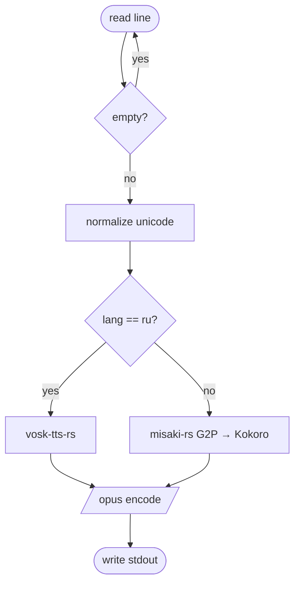

<p align="center">🦜</p>

<h1 align="center">Iago</h1>

<p align="center">
  <a href="https://github.com/drakulavich/iago/actions/workflows/test.yml"></a>
  <a href="https://www.npmjs.com/package/@drakulavich/iago"></a>
  <a href="https://opensource.org/licenses/MIT"></a>
  <a href="https://bun.sh"></a>
</p>

<p align="center"><b>Greptile-style Mermaid diagrams for AI code reviews — but driven by your own agent.</b><br>Iago perches on top of a <code>/review</code> comment and squawks a visual summary of the change: sequence, flow, class, or entity-relation.</p>

<p align="center"><i>"Awk! Awk! Add a diagram!"</i></p>

## See it

Iago turns a PR diff into a diagram and posts it on top of your `/review` comment:



- **A skill, not a SaaS** — your coding agent draws the diagram with the LLM it already runs. No API key, no third-party reviewer.
- **Works across agents** — Claude Code, Codex, Copilot, Gemini: the same `SKILL.md`.
- **Type auto-detected** — sequence, flow, class, or entity-relation, picked from the diff. Override with `/iago <type>`.

## Quick start

Requirements: **`bun`** + authenticated **`gh`**.

```bash
bunx @drakulavich/iago install --force        # installs the skill into your agent(s)
```

Claude Code user? Install the plugin instead: `/plugin marketplace add drakulavich/iago` then `/plugin install iago@iago-marketplace`.

Then, in your agent, run `/review` on a PR and follow with:

```text
/iago        # or /squawk — appends the diagram to the /review comment
```

→ All install options: [`docs/install.md`](docs/install.md) · Usage & diagram types: [`docs/usage.md`](docs/usage.md)

## Why?

Greptile and CodeRabbit auto-add Mermaid diagrams to every PR; Claude Code's and
Codex's `/review` don't draw. Iago fills that gap — using the agent you already
run, without locking you into a SaaS reviewer.

## Docs

- [Install — all agents & options](docs/install.md)
- [Usage, diagram types & `/review` hookup](docs/usage.md)
- [Diagram-selection rubric](iago/references/diagram-selection.md)
- [Contributing — repo layout, build & test](docs/development.md)
- Agent config: [`AGENTS.md`](AGENTS.md) → [`CLAUDE.md`](CLAUDE.md)

## License

Made with 🦜 squawks and zero SaaS lock-in, under the MIT License.
