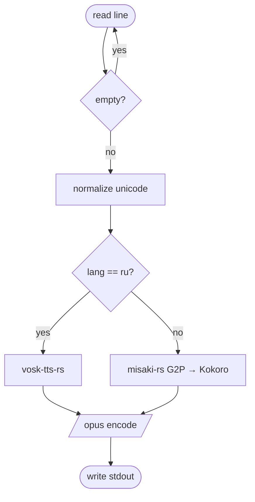

# README Restructure Implementation Plan

> **For agentic workers:** REQUIRED SUB-SKILL: Use superpowers:subagent-driven-development (recommended) or superpowers:executing-plans to implement this plan task-by-task. Steps use checkbox (`- [ ]`) syntax for tracking.

**Goal:** Slim `README.md` to a human-optimized ~60–70 lines ordered most→least important, relocating reference/contributor detail into three `docs/` files.

**Architecture:** Move existing README sections verbatim (lightly tightened) into `docs/install.md`, `docs/usage.md`, `docs/development.md`; then rewrite `README.md` to header → rendered example → 3 bullets → Quick start → Why → Docs hub → License. The diagram rubric is linked, not copied.

**Tech Stack:** Markdown only. No code, no tests. Validation = link/section checks + `claude plugin validate`.

**Conventions:** Work on branch `readme-restructure` (already created; spec committed there). The **current README is the content source** — copy sections from it into the docs files before rewriting it. Verify with the commands shown; markdown has no compiler, so checks are grep/line-count/`claude plugin validate`.

---

## File Structure

```
README.md              # MODIFY — slim to the 7-block lean structure
docs/install.md        # CREATE — all install paths (from README "Install")
docs/usage.md          # CREATE — invoke syntax, types, /review hookup (from README "Usage" + "Hooking…")
docs/development.md    # CREATE — repo layout + build/test (from README "Repo layout" + "Development")
```

The three `docs/` files are independent; each is built from a distinct current-README section, so order among Tasks 1–3 doesn't matter. Task 4 (README rewrite) must come last — it deletes the sections the docs files copied from.

---

### Task 1: `docs/install.md`

**Files:** Create `docs/install.md`. Source: current `README.md` "## Install" section (`### Option 1`…`### Option 4`, incl. runtime-requirements line, plugin namespacing, community-marketplace note, bare-name skill-copy).

- [ ] **Step 1: Read the source**

Run: `sed -n '/^## Install/,/^## Usage/p' README.md`
This is the content to relocate (everything between `## Install` and the next `## ` heading).

- [ ] **Step 2: Create `docs/install.md`**

Header + back-link, then paste the four options verbatim (drop the `## Install` H2 → make it the H1 title). Structure:

```markdown
# Installing Iago

← [back to README](../README.md)

Iago is a skill for your coding agent. Runtime requirements: **`bun`** + authenticated **`gh`** (`gh auth status`).

## Node / Bun (recommended)
<…paste Option 1 body verbatim: bunx/npx install --force, doctor, --target=both, --version, uninstall…>

## Claude Code (plugin)
<…paste Option 2 body verbatim: marketplace add/install/reload, namespacing /iago:iago, marketplace update note, community-marketplace block, bare-name git-clone copy…>

## Codex CLI
<…paste Option 3 body verbatim…>

## Copilot CLI / Gemini CLI
<…paste Option 4 body verbatim…>
```

Copy the bodies exactly from the current README (commands, code fences, notes). Only change: the section heading levels (Options become `##`), and drop the "(recommended for teams)"-style option-numbering prose if any remains.

- [ ] **Step 3: Verify**

Run: `grep -cE '^## (Node|Claude Code|Codex|Copilot)' docs/install.md`
Expected: `4`. And `grep -c 'bunx @drakulavich/iago install' docs/install.md` ≥ 1.

- [ ] **Step 4: Commit**

```bash
git add docs/install.md
git commit -m "docs: add docs/install.md (full install paths, moved from README)"
```

---

### Task 2: `docs/usage.md`

**Files:** Create `docs/usage.md`. Source: current `README.md` "## Usage" + "## Hooking it to your `/review` skill" sections.

- [ ] **Step 1: Read the source**

Run: `sed -n '/^## Usage/,/^## Repo layout/p' README.md`
(That range covers Usage and the Hooking section, up to Repo layout.)

- [ ] **Step 2: Create `docs/usage.md`**

```markdown
# Using Iago

← [back to README](../README.md)

## Invoke

<…paste the current README Usage code block: /iago, /iago 230, /iago 230 sequence, /iago --mode=comment, /squawk…>

Accepted types: `sequence`, `flow` (alias `flowchart`), `class`, `er` (aliases `erd`, `entity`).

> Installed as a Claude Code **plugin**? The commands are namespaced: `/iago:iago` and `/iago:squawk`. The bare `/iago` / `/squawk` apply to the manual skill-copy and Codex installs.

## Hooking it to your /review skill

Best UX is: run `/review` first, then `/iago` in the same session. Iago finds your `/review` comment by the marker `<!-- review-skill -->`, falling back to the most recent comment by you starting with `# Review`, `## Review`, or `### Review`.

How Iago chooses the diagram type: see [`iago/references/diagram-selection.md`](../iago/references/diagram-selection.md).
```

(Paste the invoke commands verbatim from current README. Note the `/review` fallback wording is corrected to `# / ## / ### Review` to match `post.ts`.)

- [ ] **Step 3: Verify**

Run: `grep -cE '^## (Invoke|Hooking)' docs/usage.md`
Expected: `2`. And `grep -c 'review-skill' docs/usage.md` ≥ 1.

- [ ] **Step 4: Commit**

```bash
git add docs/usage.md
git commit -m "docs: add docs/usage.md (invoke syntax, types, /review hookup)"
```

---

### Task 3: `docs/development.md`

**Files:** Create `docs/development.md`. Source: current `README.md` "## Repo layout" + "## Development" sections.

- [ ] **Step 1: Read the source**

Run: `sed -n '/^## Repo layout/,/^## License/p' README.md`

- [ ] **Step 2: Create `docs/development.md`**

```markdown
# Development

← [back to README](../README.md)

## Repo layout

<…paste the current README repo-layout code block verbatim…>

## Build & test

<…paste the current README Development body: `cd cli && bun install / bun test / bun run typecheck / bun run dev …`, plus the macOS BSD-tar + IAGO_LOCAL_TARBALL CI note, and `claude plugin validate . --strict`…>
```

Copy the tree and commands exactly from the current README.

- [ ] **Step 3: Verify**

Run: `grep -cE '^## (Repo layout|Build & test)' docs/development.md`
Expected: `2`. And `grep -c 'bun test' docs/development.md` ≥ 1.

- [ ] **Step 4: Commit**

```bash
git add docs/development.md
git commit -m "docs: add docs/development.md (repo layout + build/test)"
```

---

### Task 4: Rewrite `README.md` (lean)

**Files:** Modify `README.md`. Replace everything from the feature bullets through the `## Development` section with the lean structure below; keep the existing centered header block (lines 1–14: 🦜 / Iago / badges / tagline / quote) **unchanged**.

- [ ] **Step 1: Confirm the header block to preserve**

Run: `sed -n '1,14p' README.md`
Keep these lines verbatim (centered `<p>`/`<h1>` header, badges, tagline, quote).

- [ ] **Step 2: Replace the body** (everything after line 14 through `## License`) with exactly this:

````markdown

## See it

Iago turns a PR diff into a diagram and posts it on top of your `/review` comment:



- **A skill, not a SaaS** — your coding agent draws the diagram with the LLM it already runs. No API key, no third-party reviewer.
- **Works across agents** — Claude Code, Codex, Copilot, Gemini: the same `SKILL.md`.
- **Type auto-detected** — sequence, flow, class, or entity-relation, picked from the diff. Override with `/iago <type>`.

## Quick start

Requirements: **`bun`** + authenticated **`gh`**.

```bash
bunx @drakulavich/iago install --force        # installs the skill into your agent(s)
```
Claude Code user? Install the plugin instead: `/plugin marketplace add drakulavich/iago` then `/plugin install iago@iago-marketplace`.

Then, in your agent, run `/review` on a PR and follow with:

```text
/iago        # or /squawk — appends the diagram to the /review comment
```

→ All install options: [`docs/install.md`](docs/install.md) · Usage & diagram types: [`docs/usage.md`](docs/usage.md)

## Why?

Greptile and CodeRabbit auto-add Mermaid diagrams to every PR; Claude Code's and Codex's `/review` don't draw. Iago fills that gap — using the agent you already run, without locking you into a SaaS reviewer.

## Docs

- [Install — all agents & options](docs/install.md)
- [Usage, diagram types & `/review` hookup](docs/usage.md)
- [Diagram-selection rubric](iago/references/diagram-selection.md)
- [Contributing — repo layout, build & test](docs/development.md)
- Agent config: [`AGENTS.md`](AGENTS.md) → [`CLAUDE.md`](CLAUDE.md)

## License

MIT.
````

- [ ] **Step 3: Verify the README is lean and intact**

Run:
```bash
wc -l README.md                          # expect ~60-70
grep -nE '^## ' README.md                # expect: See it, Quick start, Why?, Docs, License
grep -c 'mermaid' README.md              # expect >=1 (the rendered example)
```
Expected: header preserved, ~5 H2 sections, line count well under 80.

- [ ] **Step 4: Commit**

```bash
git add README.md
git commit -m "docs: slim README to a human-optimized lean structure"
```

---

### Task 5: Verify links + manifests, open PR

**Files:** none (verification only)

- [ ] **Step 1: Every internal link target exists**

Run:
```bash
for f in docs/install.md docs/usage.md docs/development.md iago/references/diagram-selection.md AGENTS.md CLAUDE.md; do
  test -f "$f" && echo "OK  $f" || echo "MISSING  $f"
done
```
Expected: all `OK`.

- [ ] **Step 2: No content was lost** — the moved sections still exist somewhere

Run:
```bash
grep -rq 'bunx @drakulavich/iago install' docs/ && echo "install OK"
grep -rq 'review-skill' docs/ && echo "usage OK"
grep -rq 'cli && bun test' docs/ && echo "dev OK"
```
Expected: all three print OK.

- [ ] **Step 3: README no longer contains the relocated detail**

Run: `grep -cE 'Option [0-9]|## Repo layout|## Development|## Hooking' README.md`
Expected: `0`.

- [ ] **Step 4: Manifests still validate** (unaffected, but confirm nothing broke)

Run: `claude plugin validate . --strict`
Expected: "Validation passed" (skip if `claude` CLI unavailable).

- [ ] **Step 5: Push and open the PR**

```bash
git push -u origin readme-restructure
gh pr create --base main --title "docs: human-optimized lean README + docs/ split" --body "Slims README (~212→~65 lines) ordered most→least important: header → rendered example → 3 bullets → Quick start → Why → Docs hub → License. Relocates detail to docs/install.md, docs/usage.md, docs/development.md. Rubric linked, not duplicated."
```

---

## Self-Review

**Spec coverage:**
- Lean README outline (header / See-it example / 3 bullets / Quick start / Why / Docs hub / License) → Task 4. ✔
- Rendered flow example lead → Task 4 Step 2. ✔
- bunx quick-start + plugin one-liner alt → Task 4 Step 2. ✔
- `docs/install.md` (all paths) → Task 1. ✔
- `docs/usage.md` (invoke, types, /review hookup) → Task 2. ✔
- `docs/development.md` (repo layout + build/test) → Task 3. ✔
- Rubric linked not duplicated → Task 2 + Task 4 Docs hub (link to `iago/references/diagram-selection.md`). ✔
- Cross-links README↔docs + AGENTS/CLAUDE surfaced → Task 4 Docs hub; back-links in each docs file. ✔
- No README/docs duplication; no content lost → Task 5 Steps 2–3. ✔

**Placeholder scan:** the `<…paste … verbatim…>` markers in Tasks 1–3 are explicit *copy-from-current-README* instructions with the exact `sed` source command given in Step 1 of each — not vague TODOs. Task 4's new content is fully written out. No "TBD"/"handle edge cases".

**Consistency:** file paths (`docs/install.md`, `docs/usage.md`, `docs/development.md`) and link targets are identical across the README Docs hub, the tasks, and the verification grep. Heading names used in verify-greps match those written in Steps 2.
