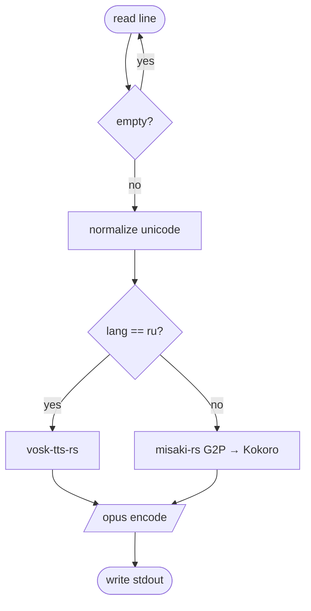

<!-- pr-diagrams:begin -->
### 🗺️ Change diagram — flow

_Auto-generated by `pr-diagrams`. Edit or remove this block; it will be replaced on the next run._

```mermaid
flowchart TD
    Start([read line]) --> Empty{empty?}
    Empty -- yes --> Start
    Empty -- no --> Norm[normalize unicode]
    Norm --> G2P{lang == ru?}
    G2P -- yes --> Vosk[vosk-tts-rs]
    G2P -- no --> Misaki[misaki-rs G2P → Kokoro]
    Vosk --> Encode[/opus encode/]
    Misaki --> Encode
    Encode --> Out([write stdout])
```
<!-- pr-diagrams:end -->
