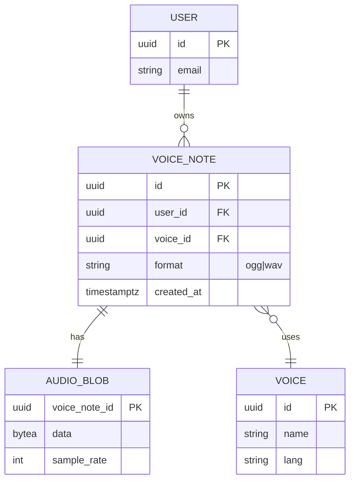

<!-- iago:begin -->
### 🗺️ Change diagram — er

_Auto-generated by `iago`. Edit or remove this block; it will be replaced on the next run._

```mermaid
erDiagram
    USER ||--o{ VOICE_NOTE : owns
    VOICE_NOTE ||--|| AUDIO_BLOB : has
    VOICE_NOTE }o--|| VOICE : uses

    USER {
      uuid id PK
      string email
    }
    VOICE_NOTE {
      uuid id PK
      uuid user_id FK
      uuid voice_id FK
      string format "ogg|wav"
      timestamptz created_at
    }
    AUDIO_BLOB {
      uuid voice_note_id PK
      bytea data
      int sample_rate
    }
    VOICE {
      uuid id PK
      string name
      string lang
    }
```
<!-- iago:end -->
