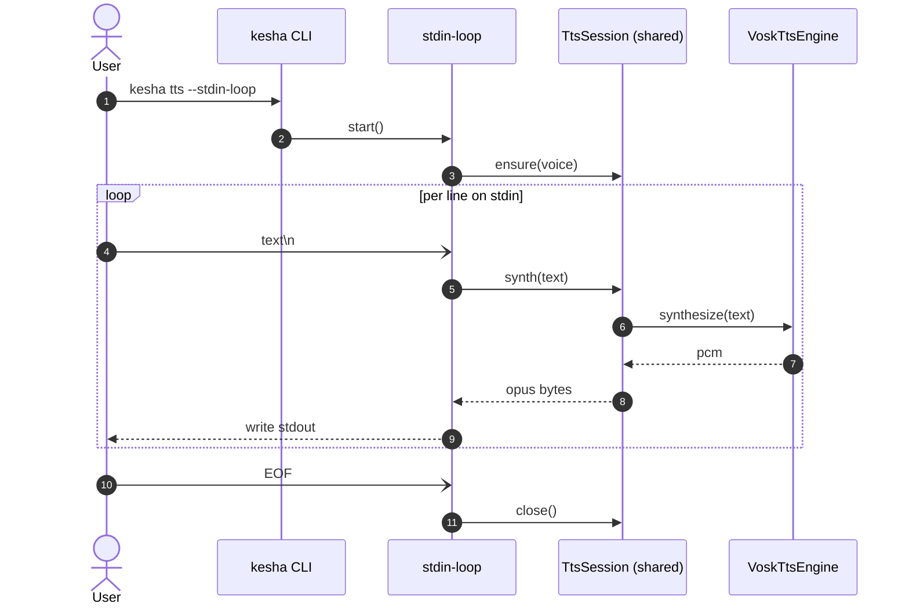

<!-- iago:begin -->
### 🗺️ Change diagram — sequence

_Auto-generated by [iago](https://github.com/drakulavich/iago). Edit or remove this block; it will be replaced on the next run._

<!-- iago:end -->
