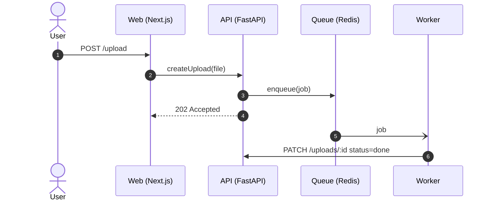
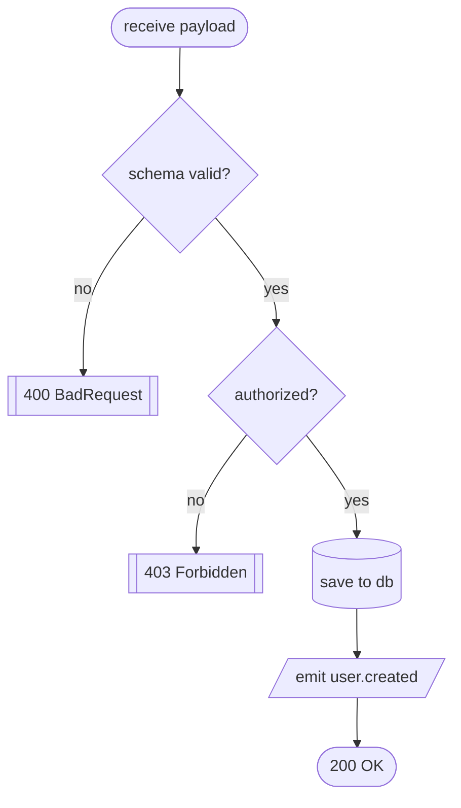
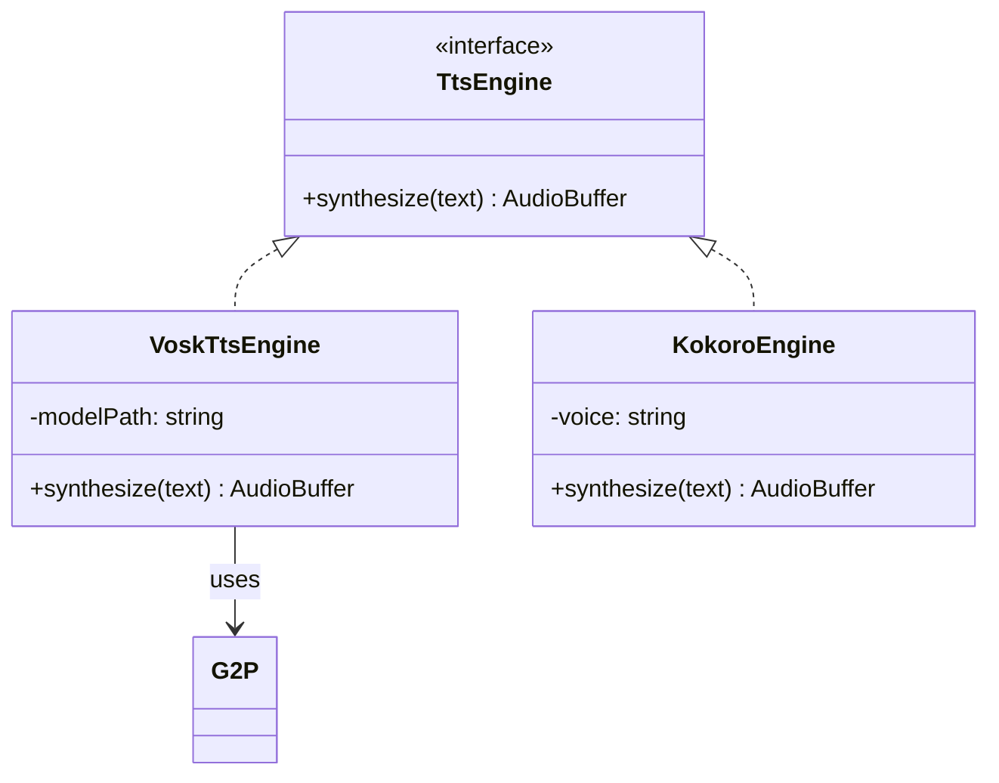
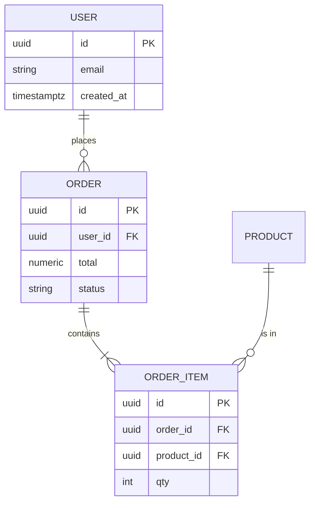

# Mermaid templates

Use these as starting points. Replace placeholder names with **real**
identifiers from the diff (functions, classes, services, tables).
GitHub renders Mermaid natively — no extra setup required.

---

## Sequence

Use for cross-component request flows. `->>` is sync, `-)` is async/fire-and-forget,
`-->>` is a return.



Tips:
- Add `autonumber` for anything with > 4 messages.
- Use `actor` for humans, `participant` for systems.
- Group retries / branches with `alt` / `else` / `loop`.

### Sequence diagram pitfalls (Mermaid will reject these)

Inside `alt` / `else` / `opt` / `loop` / `par` blocks, **every line must be a
message between participants** (e.g. `A->>B: text`) or a nested control
block — never a bare statement, comment, or pseudo-code line.

```mermaid-bad
alt invalid args
    printUsage()    %% ✗ parser error: not a message
    exit 0          %% ✗ parser error: not a message
end
Boot->>Main: continue
```

Fix it by attributing every action to a participant:

```mermaid-good
alt invalid args
    Boot->>Boot: printUsage()
    Boot-->>User: exit 0
end
Boot->>Main: continue
```

Other traps:
- Don't put blank lines inside `alt` / `loop` blocks before `end`.
- A `Note over X: ...` is fine inside blocks; a bare comment line is not.
- Mermaid `%% comments` are allowed but only on their own line.
- **Never use `;` inside a message label.** GitHub's Mermaid treats `;` as a
  statement separator inside sequence diagrams — it will split the line and
  fail to parse the trailing half. Use `,` or split into two messages:

  ```mermaid-bad
  Boot-->>User: printUsage(); exit 0     %% ✗ splits on ';'
  ```

  ```mermaid-good
  Boot-->>User: printUsage, exit 0       %% ✓ single message
  Boot-->>User: printUsage()             %% ✓ or split it
  Boot-->>User: exit 0
  ```

---

## Flow (flowchart)

Use for control flow inside one component.



Tips:
- Prefer `TD` (top-down). Use `LR` only when the chain is short and wide.
- `{}` = decision, `[]` = step, `[[ ]]` = subroutine, `[/ /]` = I/O,
  `[( )]` = data store, `(( ))` = start/end.

---

## Class

Use for inheritance / interface changes. Show only classes touched by
the diff and their direct collaborators.



Tips:
- `<|--` inheritance, `<|..` interface impl, `-->` association,
  `*--` composition, `o--` aggregation.
- Use `+` public, `-` private, `#` protected.
- Mark new members `+newField` and removed `-oldField` if useful.

---

## ER (entity relation)

Use for schema/migration diffs. Show only tables touched by the
migration plus their FK neighbors.



Cardinality cheatsheet: `||--||` 1:1, `||--o{` 1:0..N, `}o--o{` N:M.

---

## Output wrapping

Always wrap the chosen Mermaid block in this exact envelope so future
runs can replace it idempotently:

```markdown
<!-- iago:begin -->
### 🗺️ Change diagram — <type>

_Auto-generated by [iago](https://github.com/drakulavich/iago). Edit or remove this block; it will be replaced on the next run._

```mermaid
<diagram body>
```
<!-- iago:end -->
```
